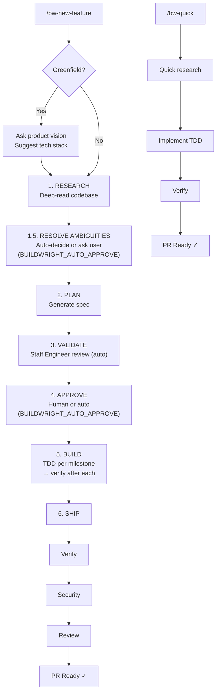

# Buildwright

**Ship code you don't read. Let automated systems be your reviewer.**

An agent-first autonomous development workflow where humans approve specifications and agents handle everything else — implementation, testing, security review, code review, and shipping.

---

## The Flow



> If anything fails → commit completed work, push, PR with failure report, exit(1). No orphaned branches.

---

## Greenfield Projects

Starting a new project? Buildwright handles it:

```
/bw-new-feature "Add product catalog with search"

> "This looks like a new project. What's the product vision?"
E-commerce platform for handmade crafts

> [AI generates steering docs + spec]
> [Presents suggested tech stack for approval]

SUGGESTED TECH STACK
────────────────────
• Frontend: React 18 + TypeScript + Vite
• Backend: Node.js + Express  
• Database: PostgreSQL
• Testing: Vitest + Playwright

Reply "approved" to proceed with this stack.
Or adjust: "approved, but use Vue instead of React"
```

One question. One approval. Tech stack + spec reviewed together.

---

## Autonomous Mode

Want fully autonomous operation? Skip human approval entirely:

```bash
# Set environment variable
export BUILDWRIGHT_AUTO_APPROVE=true

# Then run as usual
/bw-new-feature "Add user authentication"
```

**What happens:**
- Research, plan, validate still run (quality preserved)
- Spec documents committed to git BEFORE implementation
- No approval wait — proceeds directly to build
- Full audit trail in version control

```
docs(spec): add specification for user-auth

- research.md: codebase analysis
- spec.md: implementation plan
- Validated by Staff Engineer agent

Auto-approved: BUILDWRIGHT_AUTO_APPROVE=true
```

**Use autonomous mode when:**
- You trust the workflow for routine features
- Running in CI/CD pipelines
- Batch processing multiple features
- You want to review specs via git history instead of real-time

---

## Quick Start

### For Claude Code

```bash
# Add to any project
curl -sL https://raw.githubusercontent.com/raunakkathuria/buildwright/main/setup.sh | bash

# Customize steering docs
nano .buildwright/steering/product.md   # Your product context
nano .buildwright/steering/tech.md      # Your tech stack

# Start building
claude
> /bw-new-feature "Add user authentication with OAuth2"
```

### For an existing clone

```bash
# After cloning the repo, generate tool-specific configs
make sync

# This creates:
#   .claude/        (commands, agents, claws, steering — from .buildwright/)
#   .opencode/      (commands, agents, claws, steering — from .buildwright/)
#   .cursor/rules/  (commands, agents, claws, steering — from .buildwright/)
#   AGENTS.md       (from CLAUDE.md — for OpenCode compatibility)
```

### For OpenClaw

The recommended approach is to run the setup script, which installs the full workflow (commands, agents, claws, steering docs) into your project:

```bash
curl -sL https://raw.githubusercontent.com/raunakkathuria/buildwright/main/setup.sh | bash
make sync
```

Alternatively, install just the skill globally for reference across all projects:

```bash
mkdir -p ~/.openclaw/skills/buildwright
curl -s https://raw.githubusercontent.com/raunakkathuria/buildwright/main/SKILL.md > ~/.openclaw/skills/buildwright/SKILL.md
```

> **Note:** The global skill install provides buildwright's workflow guidance via SKILL.md. The slash commands (`/bw-new-feature`, `/bw-claw`, etc.) require the full project setup above.

### For OpenCode

Same as above — run the setup script for the full workflow:

```bash
curl -sL https://raw.githubusercontent.com/raunakkathuria/buildwright/main/setup.sh | bash
make sync
```

Or install the skill globally:

```bash
mkdir -p ~/.config/opencode/skills/buildwright
curl -s https://raw.githubusercontent.com/raunakkathuria/buildwright/main/SKILL.md > ~/.config/opencode/skills/buildwright/SKILL.md
```

> **Note:** The global skill install provides buildwright's workflow guidance via SKILL.md. The slash commands require the full project setup.

### For Cursor

Same setup — run the setup script for the full workflow:

```bash
curl -sL https://raw.githubusercontent.com/raunakkathuria/buildwright/main/setup.sh | bash
```

Cursor rules are generated automatically in `.cursor/rules/` by the sync step. Open the project in Cursor — steering rules apply always, commands/agents/claws apply intelligently.

---

## When to Use What

| Scenario | Approach | Why |
|----------|----------|-----|
| New feature, unclear scope | `/bw-new-feature` | Research prevents building the wrong thing |
| New feature, clear scope | `/bw-new-feature` | Spec creates audit trail + validation |
| Bug fix | `/bw-quick` | Fast path, no ceremony needed |
| Small task (< 2 hrs) | `/bw-quick` | Overhead not justified |
| Config change | `/bw-quick` | Minimal risk, quick verification |
| Refactor, clear scope | `/bw-quick` | You already know what to change |
| Refactor, unclear scope | `/bw-new-feature` | Research phase prevents breaking things |
| Greenfield project | `/bw-new-feature` | Auto-generates steering docs + tech stack |
| Prototype / spike | Just code it | Ceremony kills exploration speed |
| One-off script | Just code it | No need for spec, review, or CI |
| Learning / experimenting | Just code it | Pipeline adds friction to discovery |

---

## Commands

| Command | Purpose |
|---------|---------|
| `/bw-new-feature` | Full pipeline: research → spec → approve → build → ship |
| `/bw-quick` | Fast path for bug fixes, small tasks |
| `/bw-ship` | Quality gates + release: verify → security → review → push → PR |
| `/bw-verify` | Quick checks: typecheck, lint, test, build |
| `/bw-help` | Show available commands |

---

## Agent Personas

Modular, extensible agent personas in `.buildwright/agents/`:

| Agent | File | Used By | Purpose |
|-------|------|---------|---------|
| Staff Engineer | `staff-engineer.md` | `/bw-new-feature`, `/bw-ship` | Spec & code review |
| Security Engineer | `bw-security-engineer.md` | `/bw-ship` | OWASP, SAST, security review |

### Adding New Agents

```bash
# Create new agent persona
cat > .buildwright/agents/qa-engineer.md << 'EOF'
# QA Engineer Agent

You are a QA Engineer specialized in test coverage...

## What You Look For
...

## Output Format
...
EOF
```

Then reference in commands:
```markdown
## Adopt Persona
Read and adopt persona from `.buildwright/agents/qa-engineer.md`
```

---

## Security Review

The security phase in `/bw-ship` covers:

| Category | Checks |
|----------|--------|
| **OWASP Top 10** | All 10 categories (A01-A10:2021) |
| **SAST** | Static analysis via Semgrep |
| **Secrets** | API keys, passwords, tokens, private keys |
| **Dependencies** | npm audit, cargo audit, pip-audit |
| **Financial** | No float for currency, transaction integrity, audit logging |

### Severity Triage

Findings are classified by severity to avoid blocking on low-risk items:

| Severity | Action | Example |
|----------|--------|---------|
| **Critical / High** | Block — must fix before merge | SQL injection, exposed secrets, auth bypass |
| **Medium** | Fix in this PR if feasible, otherwise track | Missing rate limiting, verbose error messages |
| **Low / Info** | Advisory — log and move on | Minor header hardening, informational findings |

---

## Project Structure

```
your-project/
├── CLAUDE.md                      # Agent instructions (committed)
├── BUILDWRIGHT.md                 # Human documentation (committed)
├── SKILL.md                       # Agent Skills standard (committed)
├── .buildwright/                  # Canonical config (committed)
│   ├── agents/                    # Reusable personas
│   │   ├── architect.md
│   │   ├── staff-engineer.md
│   │   └── security-engineer.md
│   ├── claws/                     # Domain specialists
│   │   ├── frontend.md
│   │   ├── backend.md
│   │   ├── database.md
│   │   └── TEMPLATE.md
│   ├── commands/                  # Slash commands
│   │   ├── bw-new-feature.md
│   │   ├── bw-claw.md
│   │   ├── bw-quick.md
│   │   ├── bw-ship.md
│   │   ├── bw-verify.md
│   │   └── bw-help.md
│   ├── steering/                  # Project context
│   │   ├── product.md
│   │   ├── tech.md
│   │   ├── quality-gates.md
│   │   └── naming-conventions.md
│   └── tasks/
├── .claude/                       # Generated by `make sync` (gitignored)
│   ├── settings.json              # Claude Code permissions (committed)
│   └── agents/, claws/, commands/, steering/  (generated)
├── .opencode/                     # Generated by `make sync` (gitignored)
├── .cursor/rules/                 # Generated by `make sync` (gitignored)
├── AGENTS.md                      # Generated by `make sync` (gitignored)
├── scripts/
│   ├── sync-agents.sh             # Sync .buildwright/ → .claude/ + .opencode/ + .cursor/rules/
│   └── validate-skill.sh          # Validate SKILL.md against agentskills.io
├── docs/
│   ├── requirements/
│   ├── specs/
│   └── decisions/
└── .github/
    └── workflows/
        └── quality-gates.yml
```

> **Note:** After cloning, run `make sync` to generate `.claude/`, `.opencode/`, `.cursor/rules/`, and `AGENTS.md` from the canonical `.buildwright/` source.

---

## Design Principles (Built-In)

Every spec and implementation follows:

| Principle | Meaning |
|-----------|---------|
| **KISS** | Keep It Simple — prefer simple over clever |
| **YAGNI** | You Aren't Gonna Need It — build only what's needed now |
| **No Premature Optimization** | Make it work first, optimize with data |
| **Boring Technology** | Proven tools over shiny new ones |
| **Fail Fast** | Validate early, error loudly |

---

## Extending the Workflow

### Add New Agent

1. Create `.buildwright/agents/[role].md`
2. Define mindset, checklist, output format
3. Reference in commands with `Adopt persona from...`

### Add New Command

1. Create `.buildwright/commands/[name].md`
2. Define arguments, phases, output format
3. Reference agents as needed

### Planned Agents (Future)

| Agent | Purpose |
|-------|---------|
| QA Engineer | Test coverage, edge cases |
| Performance Engineer | Bottleneck identification |
| DevOps Engineer | Infrastructure review |
| Database Engineer | Schema review, query optimization |
| UX Engineer | API design review |

---

## Customization

| File | Purpose | Edit Frequency |
|------|---------|----------------|
| `.buildwright/steering/product.md` | Product context | Per project |
| `.buildwright/steering/tech.md` | Tech stack & commands | Per project |
| `.buildwright/agents/*.md` | Agent personas | Rarely |
| `.buildwright/commands/*.md` | Slash commands | Rarely |
| `CLAUDE.md` | Learned patterns | As discovered |

---

## FAQ

### Do I need to review code?
No. `/bw-ship` handles security review and code review automatically using Staff Engineer and Security Engineer personas.

### What if a step fails?
- **Verify fails**: Retries up to 2x automatically.
- **Security/Review fails**: No retry — requires judgment.
- **Autonomous mode** (`BUILDWRIGHT_AUTO_APPROVE=true`): Commits completed work, pushes, creates PR with failure details, exits with error code.
- **Interactive mode** (`BUILDWRIGHT_AUTO_APPROVE=false`): STOP immediately — human fixes in-session.

### Can I skip security review?
No. `/bw-ship` chains all steps. Use `/bw-verify` for quick checks during development.

### How do I add project-specific rules?
Add to `CLAUDE.md` under "Learned Patterns" or create a new agent.

---

## License

MIT
